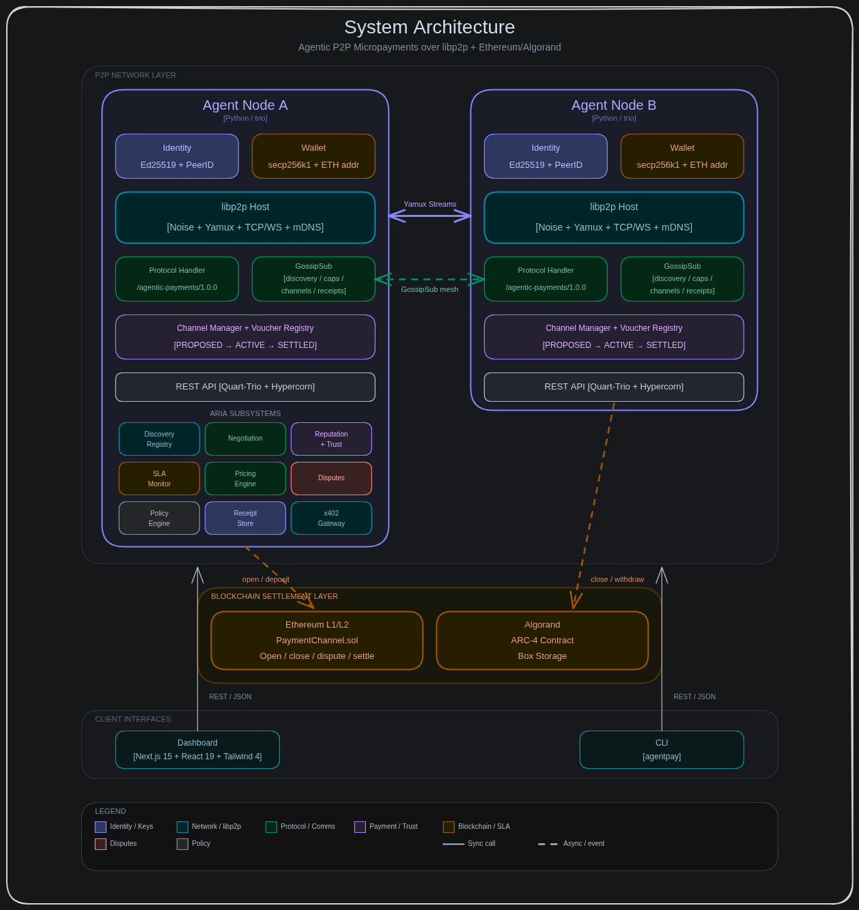
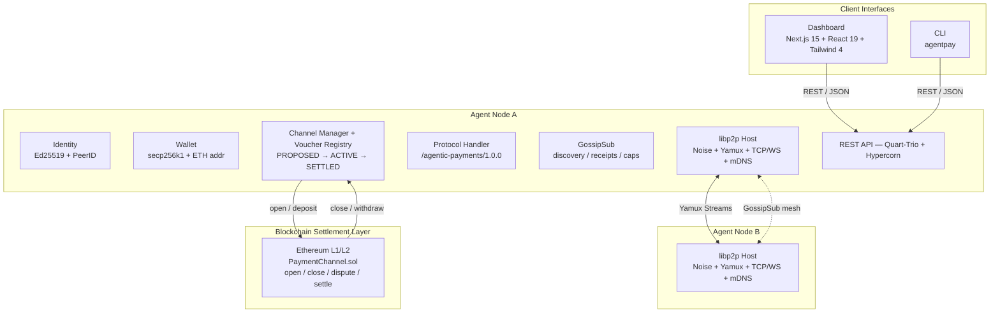
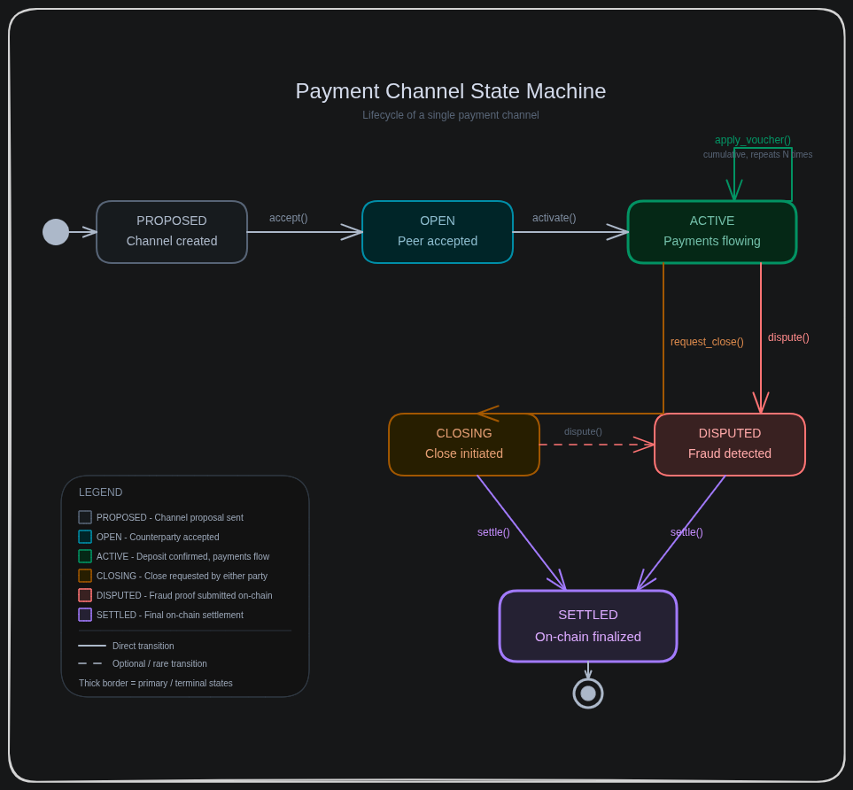
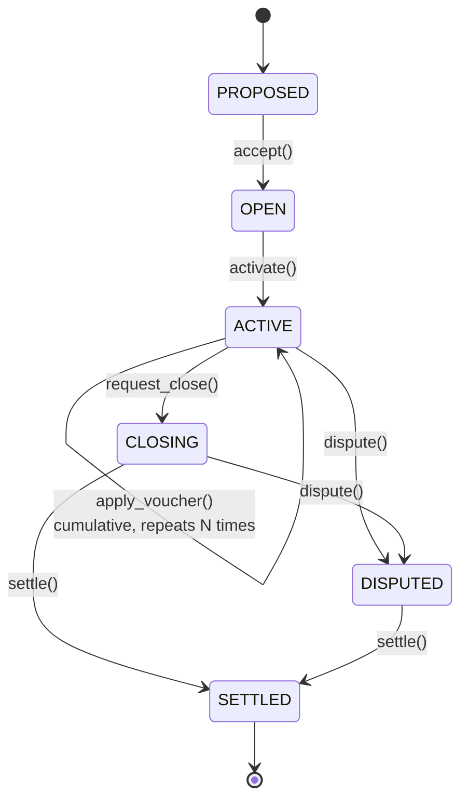
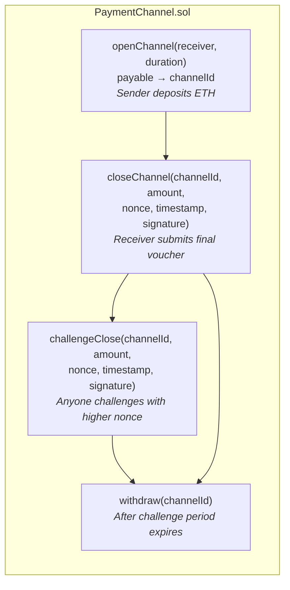
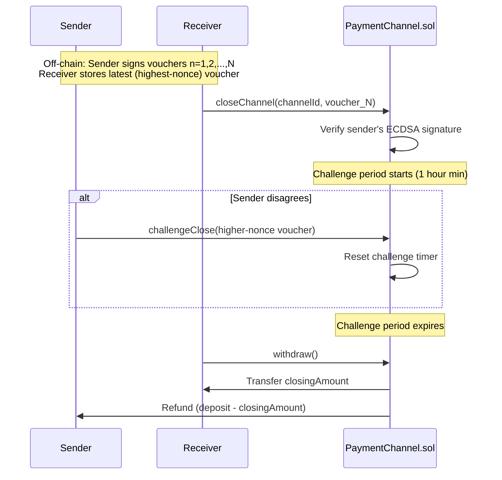
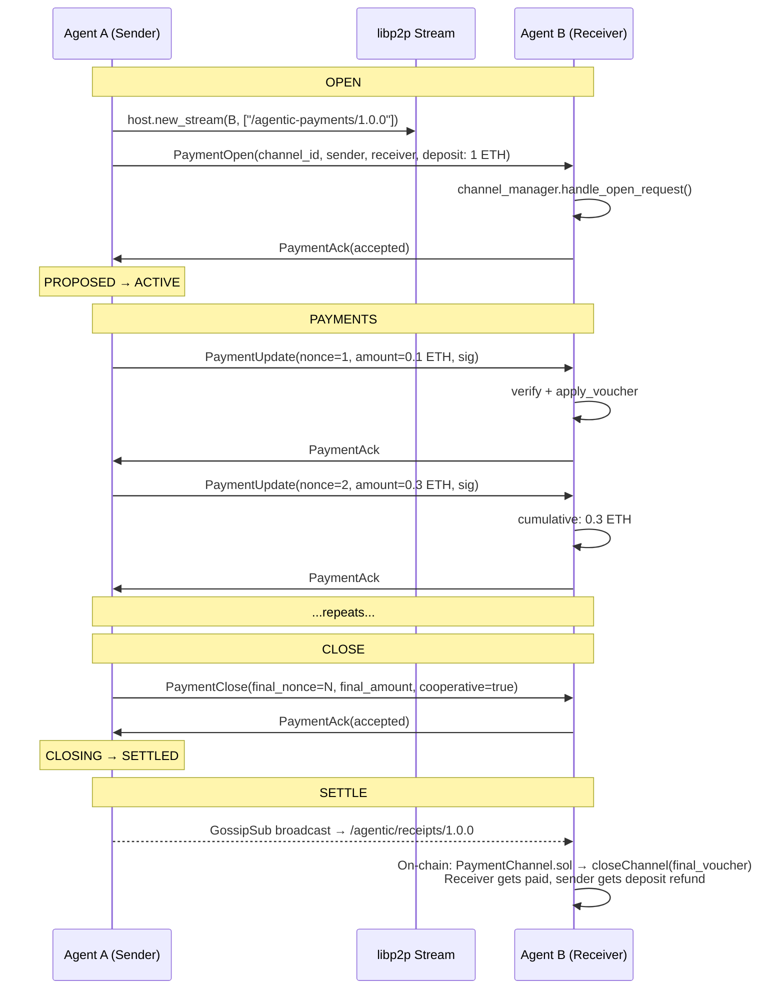
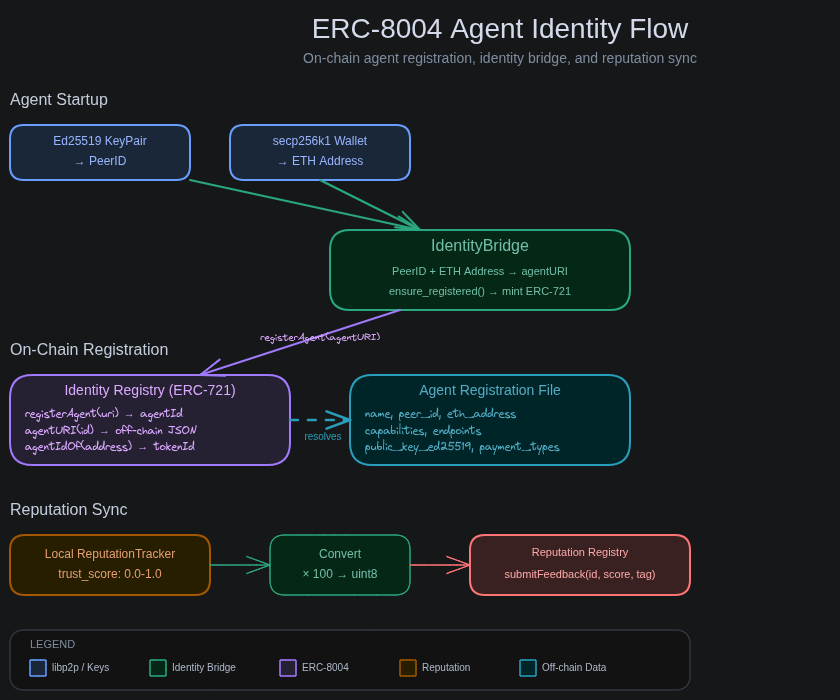

# Architecture

> Decentralized off-chain payment channels between autonomous AI agents over libp2p + Ethereum/Algorand.

---

## 1. System Overview

This system implements **off-chain payment channels** between autonomous AI agents communicating over **libp2p**. The design follows the same pattern used by Filecoin payment channels and Ethereum state channels: lock funds on-chain once, exchange signed vouchers off-chain many times, settle on-chain once.

The core insight is that agent-to-agent micropayments need sub-second latency and near-zero marginal cost per transaction. On-chain transactions are too slow and expensive for per-request payments. Payment channels solve this by moving the payment loop off-chain while preserving the security guarantees of the underlying blockchain.

<div align="center">
  
  <br />
  <em>System Architecture — Agent nodes, libp2p networking, and Ethereum settlement</em>
</div>



---

## 2. Networking Layer

### 2.1 Host Configuration

The libp2p host is created via `libp2p.new_host()` with:

- **Key pair**: Ed25519 (generated or loaded from disk)
- **Muxer**: Yamux (preferred over mplex for better flow control)
- **Security**: Noise protocol (authenticated encryption, no TLS certificates needed)
- **Discovery**: mDNS via `enable_mDNS=True` (zeroconf broadcast on LAN)
- **Transports**: TCP (default), WebSocket (optional, for browser clients)

```python
# agent_node.py — host creation
self.host = new_host(
    key_pair=key_pair,
    muxer_preference="YAMUX",
    enable_mDNS=self.config.node.enable_mdns,
)
```

The host listens on configurable TCP and WebSocket ports. Multiaddrs are advertised with the `/p2p/<peer_id>` suffix for direct dialing.

### 2.2 Stream Protocol

The custom payment protocol is registered as `/agentic-payments/1.0.0` on the libp2p host. When a remote peer opens a stream, multistream-select negotiates the protocol, then the `PaymentProtocolHandler` takes over.

Streams are **bidirectional byte pipes** multiplexed over Yamux. Multiple concurrent streams can exist between the same two peers without opening additional TCP connections.

### 2.3 Peer Discovery

Discovery has three sources, merged into a unified view:

1. **mDNS** — Automatic LAN discovery. The host's `enable_mDNS=True` flag uses zeroconf to broadcast and listen. Discovered peers are added to the host's peerstore automatically.
2. **Connected peers** — The host tracks all active connections. `host.get_connected_peers()` returns live peer IDs.
3. **Manual connections** — CLI `peer connect <multiaddr>` adds peers directly via `host.connect()`.

The `PeerDiscovery` class polls every 10 seconds, merging all three sources. New mDNS-discovered peers are pulled from the peerstore and logged.

### 2.4 GossipSub Pubsub

Four topics for coordination:

| Topic | Purpose |
|-------|---------|
| `/agentic/discovery/1.0.0` | Agent announcements (peer_id, eth_address, listen addrs) |
| `/agentic/capabilities/1.0.0` | Service advertisements and pricing |
| `/agentic/channels/1.0.0` | Channel announcements for network routing topology |
| `/agentic/receipts/1.0.0` | Payment receipts for transparency/auditing |

GossipSub is configured with meshsub protocol versions 1.0.0, 1.1.0, 1.2.0:

- `degree=8` (target mesh size)
- `degree_low=6`, `degree_high=12` (mesh bounds)
- `heartbeat_interval=120` seconds
- `strict_signing=True` (all messages signed with node's Ed25519 key)

Messages are serialized as msgpack before publishing. On startup, the node announces itself on the discovery topic with its peer ID, Ethereum address, and listen addresses.

---

## 3. Wire Protocol

### 3.1 Framing

Every message on a payment protocol stream uses length-prefix framing:

```
┌──────────────────┬──────────────────────────┐
│  4 bytes         │  N bytes                 │
│  big-endian uint │  msgpack payload         │
│  (payload length)│                          │
└──────────────────┴──────────────────────────┘
```

Maximum message size: **1 MB**. The reader calls `_read_exactly()` which loops until all bytes arrive, handling the case where `stream.read(n)` returns fewer bytes than requested.

### 3.2 Message Types

| Type | ID | Fields |
|------|:--:|--------|
| `PAYMENT_OPEN` | 1 | `channel_id`, `sender`, `receiver`, `total_deposit`, `nonce`, `timestamp`, `signature` |
| `PAYMENT_UPDATE` | 2 | `channel_id`, `nonce`, `amount` (cumulative), `timestamp`, `signature` |
| `PAYMENT_CLOSE` | 3 | `channel_id`, `final_nonce`, `final_amount`, `cooperative`, `timestamp`, `signature` |
| `PAYMENT_ACK` | 4 | `channel_id`, `nonce`, `status`, `reason` |
| `HTLC_PROPOSE` | 5 | `channel_id`, `payment_hash`, `amount`, `timeout`, `hop_count` |
| `HTLC_FULFILL` | 6 | `channel_id`, `payment_hash`, `preimage` |
| `HTLC_CANCEL` | 7 | `channel_id`, `payment_hash`, `reason` |
| `CHANNEL_ANNOUNCE` | 8 | `channel_id`, `peer_a`, `peer_b`, `capacity` |
| `NEGOTIATE_PROPOSE` | 9 | `negotiation_id`, `service_type`, `proposed_price`, `channel_deposit`, `timeout` |
| `NEGOTIATE_COUNTER` | 10 | `negotiation_id`, `counter_price` |
| `NEGOTIATE_ACCEPT` | 11 | `negotiation_id` |
| `NEGOTIATE_REJECT` | 12 | `negotiation_id`, `reason` |
| `ERROR` | 15 | `code`, `message` |

Wire format: `{"type": <int>, "data": {<fields>}}`

The handler runs a read loop on each incoming stream. Each message is dispatched by type, processed, and a typed response is written back. ACKs are terminal (not dispatched further).

---

## 4. Payment Channel Design

### 4.1 Channel State Machine

<div align="center">
  
  <br />
  <em>Payment Channel State Machine — lifecycle of a single payment channel</em>
</div>



**Transitions:**

| From | To | Trigger | Description |
|------|----|---------|-------------|
| `PROPOSED` | `OPEN` | `accept()` | Counterparty accepts the channel open proposal |
| `OPEN` | `ACTIVE` | `activate()` | On-chain deposit confirmed (or skipped in off-chain-only mode) |
| `ACTIVE` | `ACTIVE` | `apply_voucher()` | Micropayment voucher exchange loop |
| `ACTIVE` | `CLOSING` | `request_close()` | Either party initiates close |
| `ACTIVE`/`CLOSING` | `DISPUTED` | `dispute()` | Fraud detected or disagreement on final amount |
| `CLOSING`/`DISPUTED` | `SETTLED` | `settle()` | On-chain settlement confirmed |

### 4.2 Voucher Design (Filecoin-style)

Vouchers use **cumulative amounts**, not incremental. Each new voucher replaces the previous one. Only the highest-nonce voucher is needed for on-chain settlement.

```
Voucher n=1: amount=100    (paid 100 total)
Voucher n=2: amount=250    (paid 250 total, not 150 more)
Voucher n=3: amount=400    (paid 400 total)
                            ▲
                            └── Only this one needed for settlement
```

**Why cumulative?**

- Simpler on-chain verification (one voucher, one signature check)
- Receiver only needs to store the latest voucher
- No need to sum a chain of incremental payments
- Reduces dispute complexity

**Signature scheme:**

```
hash = keccak256(abi.encodePacked(channel_id, nonce, amount, timestamp))
signature = EIP-191 personal_sign(hash, sender_private_key)
```

Verification: `ecrecover(ethSignedMessageHash(hash), signature) == sender`

This is compatible with on-chain verification in the Solidity contract — the same voucher signed off-chain can be submitted directly for on-chain settlement.

### 4.3 Voucher Validation Rules

The channel enforces these invariants when applying a voucher:

1. Channel must be in `ACTIVE` state
2. `voucher.nonce > channel.nonce` (strictly increasing)
3. `voucher.amount > channel.total_paid` (strictly increasing cumulative amount)
4. `voucher.amount <= channel.total_deposit` (cannot exceed locked funds)
5. Signature must recover to the channel sender's Ethereum address

### 4.4 Channel Manager

The `ChannelManager` is an in-memory registry that tracks all channels for a node. It handles both sides of the protocol:

**Sender side** (`send_payment`):

1. Look up channel by ID
2. Increment nonce, compute new cumulative amount
3. Create and sign voucher with sender's private key
4. Apply voucher to local channel state
5. Call send function (writes `PaymentUpdate` to stream)
6. Return voucher

**Receiver side** (`handle_payment_update`):

1. Reconstruct `SignedVoucher` from the `PaymentUpdate` message
2. Verify ECDSA signature against channel sender's address
3. Apply voucher (enforces nonce ordering, amount bounds)

---

## 5. On-Chain Settlement

### 5.1 Smart Contract

The `PaymentChannel.sol` contract implements unidirectional payment channels with a challenge period:



| Function | Who calls | What it does |
|----------|-----------|--------------|
| `openChannel()` | Sender | Deposits ETH, creates channel struct, returns deterministic `channelId` |
| `closeChannel()` | Receiver | Verifies sender's ECDSA signature on voucher, starts challenge period (min 1 hour) |
| `challengeClose()` | Anyone | Submits higher-nonce voucher, resets challenge timer (fraud protection) |
| `withdraw()` | Either | After challenge expiry: receiver gets `closingAmount`, sender gets refund |

### 5.2 Settlement Flow



### 5.3 Signature Compatibility

The voucher hash is computed identically off-chain and on-chain:

```solidity
// Solidity
keccak256(abi.encodePacked(channelId, nonce, amount, timestamp))
```

```python
# Python
Web3.solidity_keccak(
    ["bytes32", "uint256", "uint256", "uint256"],
    [channel_id, nonce, amount, timestamp],
)
```

Both use EIP-191 `personal_sign` format (`\x19Ethereum Signed Message:\n32` prefix), ensuring vouchers signed in Python can be verified on-chain.

---

## 6. Payment Flow (End-to-End)

<div align="center">
  
  <br />
  <em>Payment Channel Lifecycle — open, pay, close, settle</em>
</div>



---

## 7. API Layer

The REST API runs on Quart-Trio (async Quart on the trio event loop) served by Hypercorn. It provides external access to the agent node's state and operations via ~40 endpoints.

**Core endpoints** (original):

| Method | Endpoint | Description |
|--------|----------|-------------|
| `GET` | `/health` | Health check → `{"status": "ok"}` |
| `GET` | `/identity` | `peer_id`, `eth_address`, listen addresses, chain info |
| `GET` | `/peers` | Discovered peers with addresses and connection status |
| `GET` | `/channels` | All payment channels with state |
| `GET` | `/channels/:id` | Single channel by hex ID |
| `POST` | `/channels` | Open a new payment channel |
| `POST` | `/channels/:id/close` | Cooperative close |
| `POST` | `/pay` | Send micropayment voucher → returns `{voucher}` |
| `GET` | `/balance` | Aggregate balance: `{deposited, paid, remaining}` |
| `GET` | `/graph` | Network routing graph |
| `POST` | `/route` | Find multi-hop route to destination |
| `POST` | `/route-pay` | Multi-hop HTLC payment |
| `POST` | `/connect` | Connect to peer by multiaddr |
| `GET` | `/chain` | Chain type and settlement status |

**Extended endpoints** (ARIA subsystems — see full list in [COMMANDS.md](COMMANDS.md)):

| Group | Endpoints | Purpose |
|-------|-----------|---------|
| Discovery | `/discovery/agents`, `/discovery/resources` | Agent capability search, Bazaar-compatible listing |
| Negotiation | `/negotiate`, `/negotiations`, `/negotiations/:id/*` | Service term negotiation with SLA |
| Trust | `/reputation`, `/reputation/:id`, `/receipts`, `/receipts/:id`, `/policies` | Trust scores, receipt chains, wallet policies |
| Pricing | `/pricing/quote`, `/pricing/config` | Dynamic price quotes, engine configuration |
| SLA | `/sla/violations`, `/sla/channels`, `/sla/channels/:id` | SLA compliance monitoring |
| Disputes | `/disputes`, `/disputes/:id`, `/disputes/scan`, `/channels/:id/dispute` | Dispute detection and resolution |
| Gateway | `/gateway/resources`, `/gateway/register` | x402-compatible resource gating |

CORS is enabled globally via `Access-Control-Allow-Origin: *` (after_request middleware).

The API server starts as a trio task within the agent node's nursery. It blocks until the nursery is cancelled.

---

## 8. Identity and Cryptography

### Two Key Systems

The system uses two independent key systems for different purposes:

| Key System | Curve | Purpose | Storage |
|------------|-------|---------|---------|
| **libp2p Identity** | Ed25519 | Peer identification, Noise handshake, GossipSub signing | `~/.agentic-payments/identity.key` (mode `0600`) |
| **Ethereum Wallet** | secp256k1 | Voucher signing (ECDSA), on-chain transactions | Generated fresh per session (keyfile persistence available) |

```python
# libp2p identity
key_pair = create_new_key_pair()          # Ed25519
peer_id = ID.from_pubkey(key_pair.public_key)  # 12D3KooW...

# Ethereum wallet
account = Account.create()                # secp256k1
eth_address = account.address             # 0x...
```

This separation is intentional. libp2p identity is for networking (who you are on the P2P network), while the Ethereum wallet is for value transfer (who you are on the blockchain). They are linked by the node announcing both its PeerID and ETH address on the GossipSub discovery topic.

---

## 9. Persistence

### In-Memory (Default)

The `ChannelManager` holds all channel state in a Python dict. This is sufficient for development and short-lived sessions.

### PostgreSQL (Optional)

The `ChannelStore` provides PostgreSQL persistence via asyncpg:

```sql
-- payment_channels table
CREATE TABLE payment_channels (
    channel_id   BYTEA PRIMARY KEY,
    sender       TEXT NOT NULL,
    receiver     TEXT NOT NULL,
    total_deposit BIGINT NOT NULL,
    state        TEXT NOT NULL,
    nonce        INTEGER DEFAULT 0,
    total_paid   BIGINT DEFAULT 0,
    peer_id      TEXT,
    created_at   BIGINT NOT NULL,
    updated_at   BIGINT NOT NULL
);

-- vouchers table
CREATE TABLE vouchers (
    id         SERIAL PRIMARY KEY,
    channel_id BYTEA REFERENCES payment_channels,
    nonce      INTEGER NOT NULL,
    amount     BIGINT NOT NULL,
    timestamp  BIGINT NOT NULL,
    signature  BYTEA NOT NULL,
    UNIQUE(channel_id, nonce)
);
```

---

## 10. Concurrency Model

The entire system runs on **trio**, not asyncio. This is a hard requirement from py-libp2p.

```mermaid
graph TB
    TRIO["trio.run(main)"] --> NURSERY[nursery]
    NURSERY --> NODE["agent_node.start()"]
    NODE --> HOST["host.run(listen_addrs)<br/><em>context manager, blocks</em>"]
    HOST --> PUBSUB["_run_pubsub()"]
    PUBSUB --> PS_CTX[pubsub context manager]
    PUBSUB --> PS_SUB[subscribe_all()]
    PUBSUB --> PS_PUB[publish discovery announcement]
    PUBSUB --> BCAST["broadcaster.run()<br/>per-topic listener tasks"]
    HOST --> DISC["discovery.run()<br/><em>polls every 10s</em>"]
    HOST --> API["serve_api()<br/><em>Hypercorn ASGI</em>"]
    HOST --> SLEEP["sleep_forever()<br/><em>blocks until cancel</em>"]
    HOST --> STREAMS["incoming streams<br/>→ _handle_incoming_stream()"]
```

Each incoming payment protocol stream runs in its own implicit task (dispatched by the host). Stream handlers read in a loop until the stream closes or errors.

---

## 11. Security Properties

| Property | Mechanism |
|----------|-----------|
| Transport encryption | Noise protocol (authenticated AEAD) |
| Peer authentication | Ed25519 keypair + PeerID derivation |
| Message integrity | GossipSub `strict_signing` (Ed25519) |
| Payment authorization | ECDSA signatures on vouchers (secp256k1) |
| Replay protection | Strictly increasing nonce per channel |
| Overpayment prevention | `voucher.amount <= channel.total_deposit` |
| Settlement fraud prevention | On-chain challenge period with higher-nonce override |
| Key storage | Identity key file at mode `0600`, private keys never sent to RPC |

---

## 12. Agent Discovery Protocol

AgentPay agents advertise their capabilities via GossipSub pubsub. The `CapabilityRegistry` tracks discovered agents.

### 12.1 Capability Advertisement

On startup, each agent publishes an `AgentAdvertisement` on `/agentic/capabilities/1.0.0`:
- `peer_id` — libp2p peer identifier
- `eth_address` — Ethereum/Algorand wallet address
- `capabilities` — list of `AgentCapability` (service_type, price_per_call, description)
- `addrs` — listen multiaddrs

The registry auto-prunes stale advertisements (default: 300s).

### 12.2 Discovery Announcements

Agents also announce on `/agentic/discovery/1.0.0` with basic identity info. This ensures agents are discoverable even before they publish capabilities.

### 12.3 Search

`GET /discovery/agents?capability=compute` filters by service type. `GET /discovery/resources` returns a Bazaar-compatible format for x402 ecosystem interoperability.

---

## 13. Negotiation Protocol

Before opening a payment channel, agents can negotiate terms using a 4-message protocol:

| Message | ID | Direction |
|---------|:--:|-----------|
| `NEGOTIATE_PROPOSE` | 9 | Initiator → Responder |
| `NEGOTIATE_COUNTER` | 10 | Responder → Initiator |
| `NEGOTIATE_ACCEPT` | 11 | Either → Either |
| `NEGOTIATE_REJECT` | 12 | Either → Either |

### 13.1 State Machine

```
PROPOSED → COUNTERED → ACCEPTED → CHANNEL_OPENED
                    ↘ REJECTED
         ↘ EXPIRED
```

### 13.2 SLA Terms

Negotiations can include `SLATerms`:
- `max_latency_ms` — maximum acceptable response latency
- `max_error_rate` — maximum error rate (0.0–1.0)
- `min_throughput` — minimum requests/second
- `penalty_rate` — wei penalty per violation
- `measurement_window` — compliance measurement window (seconds)
- `dispute_threshold` — violations before auto-dispute

When a negotiation with SLA terms leads to a channel, the channel is automatically registered with the SLA monitor.

---

## 14. Wallet Policies

The `PolicyEngine` enforces spend controls before any payment or channel operation:

- **Per-transaction limit**: Max wei per single payment
- **Total spend limit**: Max cumulative spend across all channels
- **Rate limiting**: Max payments per minute
- **Peer whitelist/blacklist**: Allow/deny specific peer IDs

Policy violations raise `PolicyViolation` before the payment is sent.

---

## 15. Reputation System

The `ReputationTracker` maintains per-peer trust scores:

### 15.1 Events Tracked

- `record_payment_sent(peer, amount, response_time)` — successful outbound payment
- `record_payment_received(peer, amount)` — successful inbound payment
- `record_payment_failed(peer)` — payment failure
- `record_htlc_fulfilled(peer)` / `record_htlc_cancelled(peer)` — HTLC outcomes

### 15.2 Trust Score Formula

```
trust_score = 0.4 * success_rate + 0.3 * normalized_volume + 0.2 * response_speed + 0.1 * longevity
```

Trust scores feed into:
- **Routing**: `find_route()` prefers higher-trust peers via reputation-weighted BFS
- **Pricing**: Higher trust → larger discount via `PricingEngine`
- **Frontend**: Trust-colored nodes in the network graph (green/amber/red)

---

## 16. SLA Monitoring

The `SLAMonitor` tracks per-channel compliance:

- Each payment records latency (ms) and success/failure
- Checks against `SLATerms` thresholds after every payment
- Violations are logged with type, measured value, and threshold
- Channels exceeding `dispute_threshold` violations are flagged as non-compliant

Endpoints: `GET /sla/violations`, `GET /sla/channels`, `GET /sla/channels/:id`

---

## 17. Dynamic Pricing Engine

The `PricingEngine` calculates per-service prices based on:

- **Base price**: Per service type
- **Trust discount**: Higher peer trust → lower price (configurable factor)
- **Congestion premium**: More active channels → higher price (above configurable threshold)
- Price clamped to `[min_price, max_price]` range

Endpoints: `POST /pricing/quote`, `GET /pricing/config`, `PUT /pricing/config`

---

## 18. Dispute Resolution

The `DisputeMonitor` detects and manages payment disputes:

### 18.1 Automatic Detection

`scan_channels()` checks all CLOSING/DISPUTED channels. If the receiver holds a higher nonce than the closing nonce (stale voucher attack), a dispute is auto-filed.

### 18.2 Resolution

Disputes resolve as:
- `CHALLENGER_WINS` — counterparty penalized in reputation
- `RESPONDER_WINS` — challenger penalized
- `SPLIT` — partial resolution

Slash amounts default to 10% of channel deposit.

---

## 19. Execution Reporting (Receipt Chains)

Every payment produces a `SignedReceipt` forming a hash chain per channel:

- `receipt_id` — random 16-byte identifier
- `previous_receipt_hash` — SHA-256 of prior receipt (genesis = 0x00*32)
- `signature` — EIP-191 signed receipt hash

Receipts are broadcast on `/agentic/receipts/1.0.0` via GossipSub. Other agents store them for cross-verification. `ReceiptStore.verify_chain()` validates the full hash chain integrity.

---

## 20. x402 Resource Gateway

The `X402Gateway` publishes gated resources in Bazaar-compatible format:

- `path` — resource endpoint
- `price` — price in wei
- `description` — human-readable description
- `payment_type` — payment method (channel, direct)

This enables interoperability with the Algorand x402 ecosystem (Bazaar facilitator discovery).

---

## 21. Multi-Chain Settlement

AgentPay supports both Ethereum and Algorand settlement:

### 21.1 Ethereum
- `PaymentChannel.sol` — Solidity contract with open/close/challenge/withdraw
- `Settlement` class wraps web3.py calls
- Challenge period for fraud protection

### 21.2 Algorand
- ARC-4 ABI smart contract with box storage for channel state
- `AlgorandSettlement` class wraps py-algorand-sdk
- Atomic transaction groups (app call + payment deposit)
- Box storage decoding for `(address, address, uint64, uint64, uint64, uint64, bool)` tuples
- `AlgorandWallet` — Ed25519 key management via algosdk

Chain selection is configured via `chain_type: "ethereum" | "algorand" | "filecoin"` in settings.

---

## 22. Diagrams

Architecture diagrams are in [`docs/images/`](images/):

| Diagram | Description |
|---------|-------------|
| [System Architecture](images/system-architecture.png) | Full system with all subsystems, tri-chain settlement, GossipSub topics |
| [Payment Channel Lifecycle](images/payment-channel-lifecycle.png) | 8-step sequence: open, payments, close, settle |
| [Channel State Machine](images/state-machine.png) | 6-state lifecycle: PROPOSED → ACTIVE → SETTLED |
| [Negotiation + Payment Flow](images/negotiation-flow.png) | Full flow: discovery → negotiate → open → pay → close with SLA tracking |
| [Trust Architecture](images/trust-architecture.png) | Reputation, SLA, disputes, policies, pricing interactions |
| [Module Architecture](images/module-architecture.png) | Code module dependencies across 5 layers |
| [Wire Protocol](images/wire-protocol.png) | All 13 message types with fields, framing format, and message flow |
| [HTLC Multi-Hop Routing](images/htlc-routing.png) | Multi-hop payment via intermediaries with BFS pathfinding |
| [ERC-8004 Identity Flow](images/erc8004-identity-flow.png) | Agent registration, identity bridge, reputation sync |
| [IPFS Storage Flow](images/ipfs-storage-flow.png) | Receipt pinning, CID broadcast, retrieval and verification |
| [End-to-End Code Flow](images/e2e-code-flow.png) | CLI → node init → libp2p → payment → receipt → settlement |

---

## 23. ERC-8004 Agent Identity

AgentPay supports the [ERC-8004 "Trustless Agents"](https://eips.ethereum.org/EIPS/eip-8004) standard for on-chain agent identity and reputation.

<div align="center">
  
</div>

### 23.1 Identity Bridge

The `IdentityBridge` maps the node's libp2p PeerID + ETH wallet address to an ERC-8004 `agentId` (ERC-721 token):

```
Ed25519 KeyPair → PeerID (libp2p networking)
secp256k1 Key   → ETH Address (payment signing)
                        ↓
              IdentityBridge.ensure_registered()
                        ↓
              ERC-8004 Identity Registry
              → mint ERC-721 token → agentId
              → store agentURI → off-chain registration file
```

The `agentURI` resolves to a JSON file containing the agent's name, capabilities, endpoints, and public keys — enabling discovery by other ERC-8004 agents.

### 23.2 Reputation Sync

Local trust scores (0.0-1.0 from `ReputationTracker`) are pushed to the ERC-8004 Reputation Registry as uint8 values (0-100):

- `sync_reputation()` converts and submits feedback on-chain
- Rate-limited to avoid excessive transactions
- Tags feedback with "payment" category

### 23.3 Discovery Fallback

When GossipSub returns no results for a capability search, the `CapabilityRegistry` can fall back to querying the ERC-8004 Identity Registry for on-chain agents.

### 23.4 Configuration

Enable with `--erc8004-identity <addr> --erc8004-reputation <addr>` on the CLI, or set `ERC8004_ENABLED=true` with contract addresses in environment variables.

---

## 24. Design Decisions and Tradeoffs

### Why cumulative vouchers over incremental?

Incremental vouchers require the receiver to store and sum all vouchers for settlement. Cumulative means only the latest voucher matters. This simplifies on-chain verification to a single signature check and reduces storage requirements.

### Why trio over asyncio?

py-libp2p is built on trio. Trio's structured concurrency model (nurseries) prevents orphaned tasks and makes cancellation deterministic. This matters for a long-running network daemon where leaked tasks mean leaked connections.

### Why msgpack over protobuf?

Msgpack is schema-less and needs no code generation. For a protocol with 13 message types (payments, HTLCs, negotiations, announcements), the simplicity of `msgpack.packb(asdict(msg))` outweighs protobuf's versioning benefits. Wire validation is handled by `_EXPECTED_FIELDS` checking at deserialization time. If the protocol stabilizes and needs cross-language support, protobuf is worth revisiting.

### Why in-memory channel state by default?

Payment channels are ephemeral by nature. Agents restart, channels close, vouchers expire. PostgreSQL persistence is available but not required. For development and testing, in-memory is simpler and faster. Production deployments should enable the store.

### Why two separate key systems?

libp2p identity (Ed25519) and Ethereum wallet (secp256k1) serve different purposes and have different security requirements. Merging them would require either deriving one from the other (fragile) or using a non-standard curve for one system (incompatible). Keeping them separate is the standard approach used by projects like Filecoin.

### Why GossipSub for receipts?

Payment receipts on a pubsub topic create a transparent audit log without requiring centralized infrastructure. Any peer subscribed to the topic can verify payment activity. This is useful for reputation systems, dispute evidence, and network monitoring.

### Why length-prefix framing over line-delimited?

Binary messages (msgpack) can contain newlines and null bytes. Length-prefix framing with a 4-byte big-endian header is simple, unambiguous, and efficient. It also enables the reader to allocate the exact buffer size needed.
